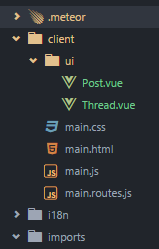

# Vue Single-file component for Meteor

It allows you to write your components in [this format](https://vuejs.org/guide/application.html#Single-File-Components) (with hot-reloading support):


## Installation


    meteor add akryum:vue akryum:vue-component


## Usage

### Hot-reloading

To enable component hot-reloading, make sure that you launch meteor in development mode (typically with `meteor` or `meteor run`). The server console should print this line:

```
Dev server (vue-components) listening on port 3003
```

Your browser console should also output:

```
[HMR] Vue component hot reload shim applied.
Dev client connected
```

Now, whenever you save a component file, it will be instantly updated on all the connected clients.

You can change the port used by the hot-reloading server with the `VUE_DEV_SERVER_PORT` environment variable:

    set VUE_DEV_SERVER_PORT=4242


### File structure

The component file must include:

 - Maximum one `<template>` tag containing the template html of your component,
 - Maximum one `<script>` tag containing the component options object in javascript,
 - And as many `<style>` tags as you wish.

You must export your code with the ES2015 statement `export default` in your `<script>` tag:


```html
<script>
// ES2015 Javascript with support for import statements
// See the 'ecmascript' meteor package for more info
export default {
    ready() {
        console.log('Hello world!');
    }
}
</script>
```

### Scoped style

By default, the css added with `<style>` tags will be applied to your entire app. But you can add the `scoped` attribute to any `<style>` tag in your component file so that the css is only applied to this specific component:


```html
<style scoped>
/* Will only be applied to this component <a> elements */
a {
   color: red;
}
</style>
```

### Language packages

Using the power of preprocessors, you can use a different language (like less or jade) by adding a `lang` attribute on your `<template>`, `<script>` or `<style>` tags.

Official packages for `<template>` tag:

- [akryum:vue-jade](https://github.com/Akryum/meteor-vue-component/tree/master/packages/vue-jade)

Official packages from `<script>` tag:

 - [akryum:vue-coffee](https://github.com/Akryum/meteor-vue-component/tree/master/packages/vue-coffee)

Official packages for `<style>` tag:

 - [akryum:vue-less](https://github.com/Akryum/meteor-vue-component/tree/master/packages/vue-less)
 - [akryum:vue-sass](https://github.com/Akryum/meteor-vue-component/tree/master/packages/vue-sass)

Community packages welcomed (add a your package with a PR)!

### Manual import

You can then import your .vue component files in your meteor code:


```javascript
// Post
import Post from '/imports/ui/Post.vue';
Vue.component('post', Post);
```

### Automatic components registration

`.vue` files outside of the `imports` directory are automatically registered as custom tags. The default tag name is the name of the file in kebab-case, and you can set your own with the `name` attribute in the component options.



In the example above, the `Post.vue` component is automatically available in your vue templates as `<post>`.

You can override the default naming behavior by setting the `name` option in your component:

```html
<script>
export default {
  name: 'selected-thread',
  // other options...
}
</script>
```

Here your component will be available as `<selected-thread>` regardless of the file name.

### Package name

If your component files are in a package, they will have the `packageName` attribute set. You can access it in your component instances like this:

```javascript
let packageName = this.$options.packageName;
```

It will be null if the components is in your application code.

---

LICENCE ISC - Created by Guillaume CHAU (@Akryum)
