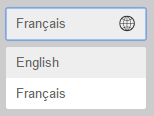
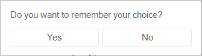

# Premade ui components for akryum:vue-i18n

Key-in-hand vue components for [akryum:vue-i18n](https://github.com/Akryum/meteor-vue-component/tree/master/packages/vue-i18n)

## Installation

    meteor add akrym:vue-i18n-ui


## Language selector



### Usage

Import the component in yours:

```javascript
import {LocaleSelect} from 'meteor/akryum:vue-i18n-ui';

export default {
  components: {
    LocaleSelect
  }
}
```

Or register it as a global component:

```javascript
import {LocaleSelect} from 'meteor/akryum:vue-i18n-ui';
Vue.component('locale-select', LocaleSelect);
```

Then use it in your component template:

```html
<locale-select></locale-select>
```

### Properties

Template | Default | Description
--- | --- | ---
`prompt-remember` | `true` | (Boolean) When the user selects a language, open a dialog asking if the choice must be saved.
`use-native-names` | `true` | (Boolean) Show the language names in their native form or use the english names.



