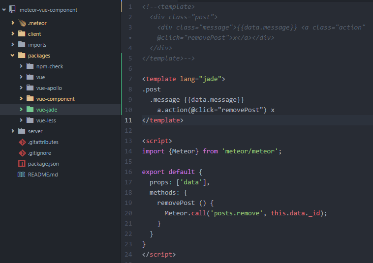

# Integrate jade with vue single-file components for Meteor

This meteor package adds [jade](http://jade-lang.com) support in your single-file `.vue` components.

## Installation

    meteor add akryum:vue-jade


## Usage

```html
<template lang="jade">
.post
  .message {{data.message}}
    a.action(@click="removePost") x
</template>
```



---

LICENCE ISC - Created by Guillaume CHAU (@Akryum)
